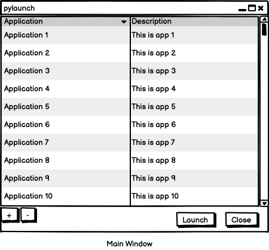
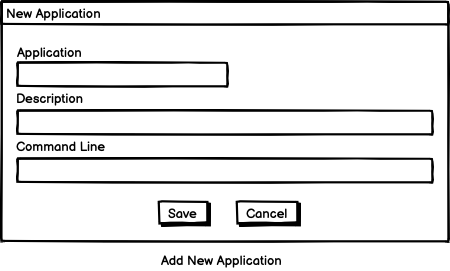

# pylaunch Design Document

## Overview

This document contains the design and the decisions leading to the design of the pylaunch application.

## Constraints

The pylaunch application should execute on both Unix and Windows platforms.

## Main Window

The main window (Figure 1) provides a single point for launching command line applications, scripts, or anything that requires the addition of command line arguments.



The main window has the following controls:

| Control | Description |
| ---- | ---- |
| Scroll Window | The scroll window contains a list of the applications and a brief description for the application. |
| '+' button | The '+' button allows the user to add a new application. |
| '-' button | The '-' button allows the user to delete the application that is currently selected in the scroll window. |
| Launch | The launch button launches the application that is currently selected in the scroll window. |
| Close | The close button closes pylaunch. |

Double-clicking on a managed application will launch a context menu that offers the capability to edit, launch, or delete the selected managed application.

Right-clicking on a managed application will launch the edit dialog.

## Add New Application

The Add New Application window (Figure 2) allows the user to create an entry for a new application.



The Add New Application window has the following controls:

| Control | Description |
| ------- | ----------- |
| Application text field | A descriptive name for the application. |
| Description text field | A more detailed description of the application. |
| Command Line text field | The command line application name and its parameters. |
| Save button | This button saves the new application data to persistent storage (disk), updates the scroll window on the main window, then closes the entry dialog. |
| Cancel button | This button discards the contents of the dialog and closes the window |

## Data Storage

The data associated with the application will be stored in a YAML-formatted file. The format is:

```
   # pylaunch application data
   applications:
    - application: application name
      description: application description
      command_line: application parameters
      first_added: date entry was first added
      last_modified: date entry was last modified
```

Example:
```
    # pylaunch application data
    applications:
      - application: FFSite Development
      - description: Launch VS Code for FFSite
      - ~/bin/ffdev
```

